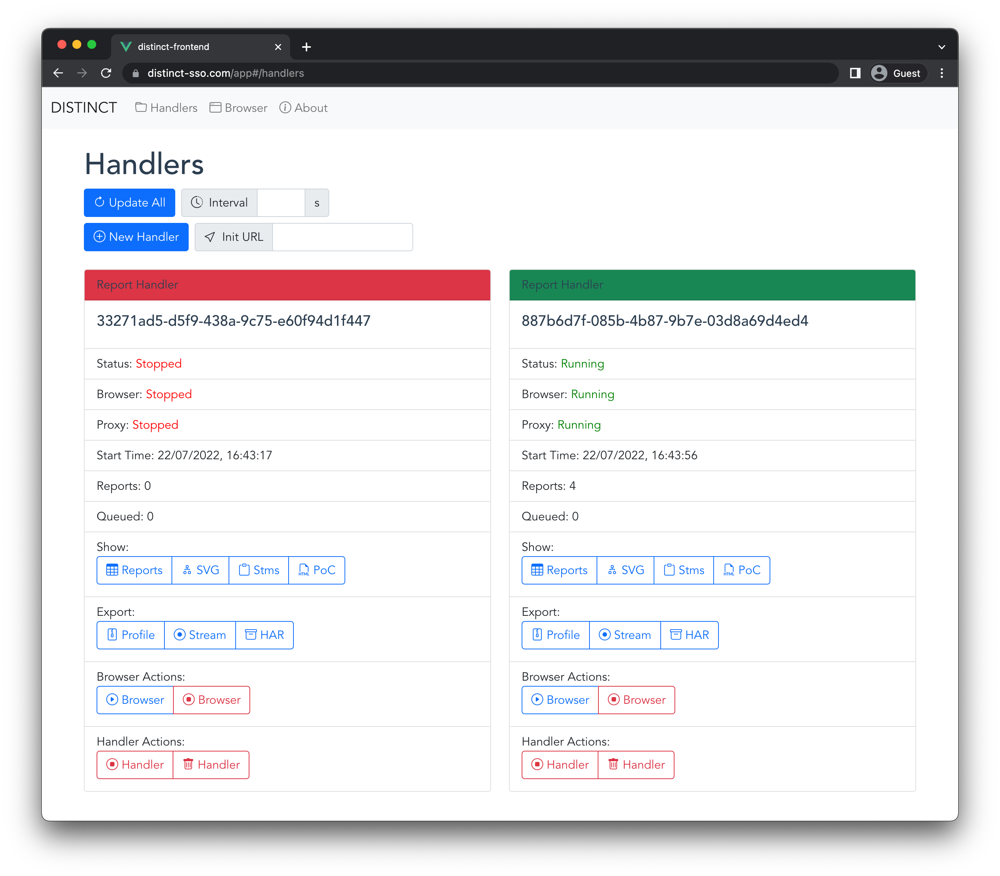

# DISTINCT: Dynamic In-Browser Single Sign-On Tracer Inspecting Novel Communication Techniques

DISTINCT is a Single Sign-On security analysis framework for modern communication techniques that was developed for the [paper](https://distinct-sso.com/paper.pdf) "DISTINCT: Identity Theft using In-Browser Communications in Dual-Window Single Sign-On".

## Quick Start

- Install [Docker](https://docs.docker.com/get-docker/) and [Docker-Compose](https://docs.docker.com/compose/install/)
- Make sure ports `9070`, `9080`, and `9090` are free on your host
- Clone this repo: `git clone https://github.com/RUB-NDS/DISTINCT.git`
- Go into its `src` directory: `cd ./DISTINCT/src`
- Run: `docker-compose build`
- *Optional:* Configure log level, password, and identity provider accounts
  - Create `.env` file in `./src`: `cp .env.example .env`
  - For `VERBOSITY`, choose between `DEBUG`, `INFO`, `WARNING`, `ERROR`, `CRITICAL` (default: `DEBUG`)
  - For `VNCPWD`, choose a custom password that is required in the web interface to control the browser (default: `changeme`)
  - You can optionally preconfigure your Google, Facebook, and Apple accounts. This automates the authentication on the identity provider so that you do not have to enter your credentials (username/email and password) for each Single Sign-On login flow.
    - For Apple, you can optionally configure a 2FA token so that you do not have to enter the 2FA code sent to your phone for each login flow. You can generate this token as follows:
      - Open a fresh incognito browser session
      - Go to `https://appleid.apple.com/auth/authorize?client_id=com.twitter.twitter.siwa&redirect_uri=https%3A%2F%2Ftwitter.com&response_type=code&state=123`
      - Log in at Apple with your credentials
      - Enter the 2FA code that is sent to your device
      - Click the "Trust" button when asked whether you trust this browser (this is important!)
      - Do **not** click "Continue" when asked for your consent but instead open the developer tools and check the cookies for `appleid.apple.com`
      - There should be a `DES...=...` cookie for `appleid.apple.com`, this is the 2FA token
      - Copy this cookie in the following format to the `.env` file: `cookie_name=cookie_value` (example: `DES123=XYZ`)
- Run: `docker-compose up`
- Open `http://localhost:9080` in your webbrowser for DISTINCT's web interface
  - If prompted, the default password for the noVNC server is: `changeme`
- *Optional:* Open `http://localhost:9070` in your webbrowser for a web interface showing DISTINCT's database ([mongo-express](https://github.com/mongo-express/mongo-express))
- Press `Ctrl+C` and run `docker-compose down` to close and exit the tool

## Develop and Rebuild

If you want to make changes to DISTINCT's source code, you have two options:

1. Rebuild the Docker container:
  - Press `Ctrl+C` and run `docker-compose down` to close and exit the tool
  - Make changes to DISTINCT's source code
  - Rebuild: `docker-compose build`
  - Start DISTINCT: `docker-compose up`
2. Click the "Open in Gitpod" button and let [Gitpod.io](https://gitpod.io/) configure a fully-fledged, instant development environment in the cloud
  - Visual Studio Code will appear in your browser when the gitpod starts
  - VSCode will automatically open 5 terminals and compile, initialize, and run DISTINCT
    - `distinct-core-api` - runs the Python backend (Communication Inspector) that serves an API and the *compiled GUI*
    - `distinct-core-gui` - runs the live-refreshing Vue.js server that also serves the GUI
    - `distinct-browser-api` - runs the API that controls the browser
    - `distinct-browser-novnc` - runs the noVNC server (do not touch that)
    - `distinct-db` - runs DISTINCT's database (do not touch that)
  - You can make any changes to DISTINCT's Python backend, Vue.js frontend, Python browser API, or Chrome extension
    - If you make changes to the Python code, make sure to restart the appropriate Python script (`distinct-core.py` or `distinct-browser.py`)
    - If you make changes to the Vue.js code, you can directly see the changes on the live-refreshing Vue.js server; or you need to recompile (`npm run build`) the Vue.js code and restart `distinct-core.py`
    - If you make changes to the Chrome extension, just start a new browser via DISTINCT's web interface; the changed extension is automatically updated and loaded

## Workflow via DISTINCT's Web Interface

- Refresh Analysis Results:
  - DISTINCT's web interface is connected to a backend API
  - To refresh all analysis results, click on "Update"
  - You can also set a fixed interval (in seconds) at which the interface should update its results
- Start New Analysis:
  - To start a new analysis, click on "New Analysis Run"
  - You can optionally configure a URL (i.e., `https://indeed.com`), which you want to analyze, in the "URL" field
  - Otherwise, you have to submit the URL in the browser later
- Start Browser:
  - On the new running analysis instance, click on "Browser Actions" --> "Run Browser"
- Execute SSO Flow:
  - If the browser shows up in the "Live-Monitor" view, interact with the website and execute the Single Sign-On login flow
  - If you did not configure a "URL", you have to first enter the website under analysis in the browser's address bar
- Stop Browser:
  - If the SSO login flow is completed and you are logged in on the website, exit the browser by opening the "Communication-Inspector" view and click on "Browser Actions" --> "Stop Browser"
- Investigate the Analysis Results:
  - In the statistics, you can see the number of reports (= in-browser communications) that were captured by Live-Monitor's Chrome extension
  - You can see all reports in a table view by clicking on "Show" --> "Reports"
    - You can submit a search query to filter results, or you can select one of our pre-defined search queries
    - To pretty print the HTML code, check the "Pretty Print HTML" checkbox
  - You can see the sequence diagram by clicking on "Show" --> "SVG"
  - You can see Single Sign-On specific measurements and statistics by clicking on "Show" --> "Stms"
    - These results include the SSO flow type (textbook, popup, iframe), the identity provider, the login request and response, and the frame in which these requests where issued
  - You can generate the proof of concept (PoC) HTML code by clicking on "Show" --> "PoC"
- Export the Analysis Results:
  - To export the Chrome profile, click on "Export" --> "Profile"
  - To export the requests and responses captured by the Proxy in the "Stream" format, click on "Export" --> "Stream"
  - To export the requests and responses captured by the Proxy in the "HAR" format, click on "Export" --> "HAR"
- Export all Analysis Results:
  - You can directly access DISTINCT's JSON-based database on `http://localhost:9070`. There, you can export all analysis instances along with their in-browser communications, Chrome profiles, and Proxy captures.
- Stop the Analysis:
  - To stop the analysis, click on "Instance Actions" --> "Stop Instance"
  - You cannot restart a stopped analysis instance
  - Each analysis can open only one browser. To open another browser, start a new analysis.
- Remove the Analysis:
  - To remove the analysis, click on "Instance Actions" --> "Remove Instance"
  - **IMPORTANT:** This irreversibly removes the entire analysis instance, all of its captured reports, the Chrome profile, and all Proxy captures.

## Project Structure

- `./distinct-core` - contains the Python backend code that receives and processes the in-browser reports generated by the Chrome extension; and the Vue.js frontend code that presents the analysis results from the Python backend to the analyst
  - `./gui` - contains the Vue.js frontend code for DISTINCT's web interface
  - `./model` - contains all Python classes for the backend's post-processing
  - `./plantuml` - contains the Java tool that is used to generate the sequence diagram
  - `./processors` - contains the processors for each report that generate the output (i.e., sequence diagram) and analyze the security
- `./distinct-browser` - contains an Ubuntu system with a pre-configured Chromium browser runnning the Chrome extension
  - `./ace-chrome-extension` - contains the Chrome extension that automates the logins on the identity providers
  - `./api` - contains the API that is used by DISTINCT's backend to start, stop, and configure the browser
  - `./distinct-chrome-extension` - contains the Chrome extension that captures the in-browser communications during the SSO login flow
  - `./mitmproxy` - contains the proxy that is used to capture and store all requests and responses issued by the browser
  - `ublock-chrome-extension` - contains the [uBlock Origin Chrome extension](https://github.com/gorhill/uBlock) which is used to reduce the noise introduced by advertisements and trackers
  - `distinct-chromium.zip` - contains the compiled binary of the Chromium browser

## Troubleshoot

To reset DISTINCT and clear its database, run the following commands:
- Press `Ctrl+C` and run `docker-compose down` to close and exit the tool
- Remove all volumes: `docker volume rm src_distinct-core-data src_distinct-browser-data src_distinct-db-data`
- Start DISTINCT: `docker-compose up`

## Demo Mode

To compile and run DISTINCT in a "demo mode" as on [distinct-sso.com](https://distinct-sso.com), run the following commands:
- Press `Ctrl+C` and run `docker-compose down` to close and exit the tool running in "normal mode"
- Compile the "demo mode" version: `docker-compose -f docker-compose-demo.yml build`
- Start DISTINCT in "demo mode": `docker-compose -f docker-compose-demo.yml up`
- Go to `http://localhost:9070` and manually add example data to the database
  - Note that the "demo mode" does not include a running browser. Thus, you cannot generate any new data while in "demo mode" and have to supply the example data by yourself in the database.
