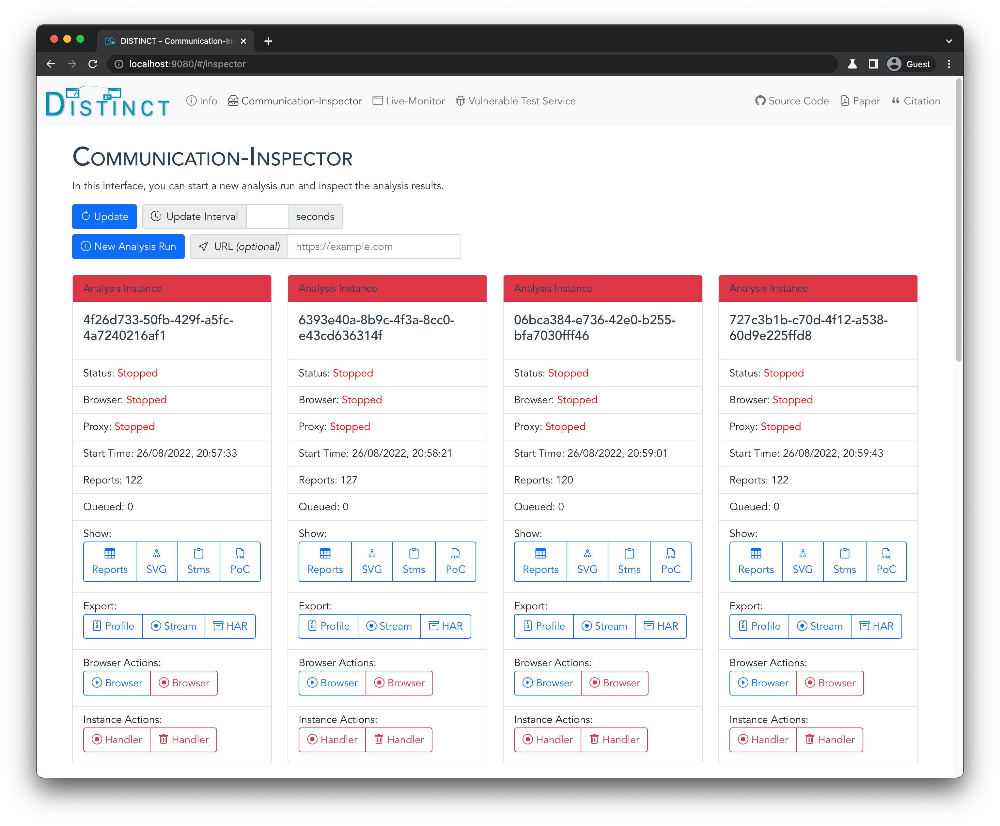

# DISTINCT

Dynamic In-Browser Single Sign-On Tracer Inspecting Novel Communication Techniques

DISTINCT is an analysis framework for modern communication techniques that was developed for the paper "DISTINCT: Identity Theft using In-Browser Communications in Modern Single Sign-On".

## Setup

Setup was tested on `Ubuntu 20.04.3 LTS`

- Download and install [Docker](https://docs.docker.com/get-docker/)
  - Check that ports `9080` and `9090` are not allocated on your system
- Clone this repository: `git clone https://github.com/XXXX/DISTINCT.git`
- Go into its `src` directory: `cd ./src`
- Run: `docker-compose build`
- *Optional:* Configure log level and accounts
  - Create `.env` file in `./src`: `cp .env.example .env`
  - For `VERBOSITY`, choose between `DEBUG`, `INFO`, `WARNING`, `ERROR`, `CRITICAL` (default: `DEBUG`)
  - You can optionally configure your Google, Facebook, and Apple username (= email) and password. This automates the authentication on the Identity Provider so that you do not have to enter your credentials for each login flow.
    - For Apple, you can optionally configure a 2FA token so that you do not have to enter the 2FA code sent to your phone for each login flow. You can generate this token as follows:
      - Open a fresh incognito browser session
      - Go to `https://appleid.apple.com/auth/authorize?client_id=com.twitter.twitter.siwa&redirect_uri=https%3A%2F%2Ftwitter.com&response_type=code&state=123`
      - Log in at Apple with your credentials
      - Enter the 2FA code that is sent to your device
      - Click the "Trust" button when asked whether you trust this browser (this is important!)
      - Do **not** click "Continue" when asked for your consent but instead open the developer tools and check the cookies for `appleid.apple.com`
      - There should be a `DES...=...` cookie for `appleid.apple.com`, this is the 2FA token
      - Copy this cookie in the following format to the `.env`: `cookie_name=cookie_value` (example: `DES123=XYZ`)
- Run: `docker-compose up`
- Open `http://localhost:9080` in your webbrowser
- Press `Ctrl+C` and run `docker-compose down` to close and exit the tool

## Workflow via DISTINCT's Web Interface

- Refresh Analysis Results:
  - DISTINCT's web interface is connected to a backend API
  - To refresh all analysis results, click on "Update All"
  - You can also set a fixed interval (in seconds) at which the interface should update its results
- Start New Analysis:
  - To start a new analysis, click on "New Handler"
  - You can optionally configure a URL (i.e., `https://indeed.com`), which you want to analyze, in the "Init URL" field
  - Otherwise, you have to submit the URL in the browser later
- Start Browser:
  - On the new running report handler, click on "Actions" --> "Run Browser"
- Execute SSO Flow:
  - If the browser shows up in the "Browsers" view, interact with the website and execute the Single Sign-On login flow
  - If you did not configure an "Init URL", you have to first enter the website under analysis in the address bar
- Stop Browser:
  - If the SSO login flow is completed, exit the browser by opening the "Handlers" view and click on "Actions" --> "Stop Browser"
- Investigate the Analysis Results:
  - In the statistics, you can see the number of reports (= in-browser communications) that were captured by the Chrome extension
  - You can see all reports in a table view by clicking on "Show" --> "Reports"
    - You can submit a search query to filter results, or you can select one of our pre-defined search queries
    - To pretty print the HTML code, check the "Pretty Print HTML" checkbox
  - You can see the sequence diagram by clicking on "Show" --> "SVG"
  - You can see Single Sign-On specific measurements by clicking on "Show" --> "Stms"
    - These results include the SSO flow type (textbook, popup, iframe), the Identity Provider, the login request and response, and the frame in which these requests where issued
  - You can generate the proof of concept (PoC) HTML code by clicking on "Show" --> "Poc"
- Export the Analysis Results:
  - To export the Chrome profile, click on "Export" --> "Profile"
  - To export the requests and responses captured by the Proxy in the "Stream" format, click on "Export" --> "Stream"
  - To export the requests and responses captured by the Proxy in the "HAR" format, click on "Export" --> "HAR"
- Stop the Analysis:
  - To stop the analysis, click on "Actions" --> "Stop Handler"
  - You cannot restart a stopped analysis
  - Each analysis can open only one browser instance. To open another browser instance, start a new analysis.

## Layout

- `./distinct-core` - contains the Python backend code that receives and processes the in-browser reports generated by the Chrome extension; and the Vue.js frontend code that presents the analysis results from the Python backend to the analyst
  - `./distinct-gui` - contains the Vue.js frontend code for DISTINCT's web interface
  - `./model` - contains all Python classes for the backend's post-processing
  - `./plantuml` - contains the Java tool that is used to generate the sequence diagram
  - `./processors` - contains the processors for each report that generate the output (i.e., sequence diagram) and analyze the security
- `./distinct-browser` - contains an Ubuntu system with a pre-configured Chromium browser runnning the Chrome extension
  - `./ace-chrome-extension` - contains the Chrome extension that automates the logins on the Identity Providers
  - `./distinct-browser-api` - contains the API that is used by DISTINCT's backend to start, stop, and configure the browser
  - `./distinct-chrome-extension` - contains the Chrome extension that captures the in-browser communications during the SSO login flow
  - `./mitmproxy` - contains the proxy that is used to capture and store all requests and responses issued by the browser
  - `ublock-chrome-extension` - contains the [uBlock Origin Chrome extension](https://github.com/gorhill/uBlock) which is used to reduce the noise introduced by advertisements and trackers
  - `distinct-chromium.zip` - contains the compiled binary of the Chromium browser
